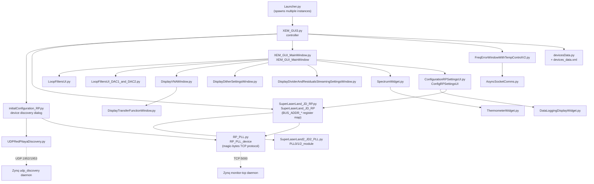

# Python GUI architecture (`digital_servo_python_gui/`)

This document walks through the module hierarchy of the PyQt5 desktop GUI —
entry point, main window and its child dialogs, the hardware abstraction
layer, and supporting/standalone utilities and tests. See
[pll-firmware-architecture.md](pll-firmware-architecture.md) for the FPGA side
and [python-fpga-communication.md](python-fpga-communication.md) for the wire
protocol itself.

## Layer sketch

## 1. Entry point

- **[XEM_GUI3.py](../digital_servo_python_gui/XEM_GUI3.py)** — `controller` class.
  Boots the `QApplication`, runs `initialConfiguration_RP.py`'s device-discovery
  dialog, then creates one `SuperLaserLand_JD_RP` (hardware handle) + one
  `XEM_GUI_MainWindow` (UI) per selected board.
- **[Launcher.py](../digital_servo_python_gui/Launcher.py)** sits above this,
  spawning multiple `XEM_GUI3.py` processes for multi-box setups. Hard-coded
  per-machine via `strCombLocksFolder` — not portable, not the canonical entry
  point.

## 2. Main window and its child dialogs

**[XEM_GUI_MainWindow.py](../digital_servo_python_gui/XEM_GUI_MainWindow.py)**
(`XEM_GUI_MainWindow`) is the central widget. It owns the hardware handle and
opens/owns these dialogs on demand:

- [LoopFiltersUI.py](../digital_servo_python_gui/LoopFiltersUI.py) /
  [LoopFiltersUI_DAC1_and_DAC2.py](../digital_servo_python_gui/LoopFiltersUI_DAC1_and_DAC2.py)
  — PLL loop-filter tuning
- [DisplayVNAWindow.py](../digital_servo_python_gui/DisplayVNAWindow.py) →
  internally owns
  [DisplayTransferFunctionWindow.py](../digital_servo_python_gui/DisplayTransferFunctionWindow.py)
  for plotting
- [DisplayDitherSettingsWindow.py](../digital_servo_python_gui/DisplayDitherSettingsWindow.py),
  [DisplayDividerAndResidualsStreamingSettingsWindow.py](../digital_servo_python_gui/DisplayDividerAndResidualsStreamingSettingsWindow.py)
- [SpectrumWidget.py](../digital_servo_python_gui/SpectrumWidget.py) (embeds
  [ThermometerWidget.py](../digital_servo_python_gui/ThermometerWidget.py) as
  a sub-gauge)
- [user_friendly_QLineEdit.py](../digital_servo_python_gui/user_friendly_QLineEdit.py)
  — shared custom `QLineEdit` used throughout these dialogs

**[FreqErrorWindowWithTempControlV2.py](../digital_servo_python_gui/FreqErrorWindowWithTempControlV2.py)**
is a separate top-level window (frequency-error + temperature control),
created independently by `XEM_GUI3.py`, talking to hardware over its own
[AsyncSocketComms.py](../digital_servo_python_gui/AsyncSocketComms.py)
connection rather than through `XEM_GUI_MainWindow`.

**[ConfigurationRPSettingsUI.py](../digital_servo_python_gui/ConfigurationRPSettingsUI.py)**
(`ConfigRPSettingsUI`) is a settings dialog; it itself owns a
`SuperLaserLand_JD_RP` reference and a
[DataLoggingDisplayWidget.py](../digital_servo_python_gui/DataLoggingDisplayWidget.py)
child widget.

## 3. Hardware abstraction layer

- **[SuperLaserLand_JD_RP.py](../digital_servo_python_gui/SuperLaserLand_JD_RP.py)**
  (`SuperLaserLand_JD_RP`) — the board model; holds all `BUS_ADDR_*`/
  `ENDPOINT_*` register constants (the FPGA register map). Delegates
  PLL-specific gain/limit math to
  **[SuperLaserLand2_JD2_PLL.py](../digital_servo_python_gui/SuperLaserLand2_JD2_PLL.py)**
  — `PLL0_module`/`PLL1_module`/`PLL2_module`, each calling back into the
  owning `SuperLaserLand_JD_RP` instance for register I/O rather than
  touching sockets directly.
- **[RP_PLL.py](../digital_servo_python_gui/RP_PLL.py)** (`RP_PLL_device`) —
  the wire-protocol layer; a raw TCP socket to the Zynq's `monitor-tcp`
  daemon speaking the magic-bytes framed protocol, plus an Opal-Kelly
  compatibility shim retained from the project's earlier USB FPGA board.
- **[initialConfiguration_RP.py](../digital_servo_python_gui/initialConfiguration_RP.py)**
  — discovery dialog; uses
  [UDPRedPitayaDiscovery.py](../digital_servo_python_gui/UDPRedPitayaDiscovery.py)
  (broadcast/LAN board discovery) and hands the chosen IP to
  `RP_PLL_device`; can also push firmware/software updates via the same
  file-transfer protocol.
- **[devicesData.py](../digital_servo_python_gui/devicesData.py)** +
  `devices_data.xml` — static serial-number → UI-color/name/config registry,
  consulted by the entry point when multiple boards are present.

## Supporting/standalone utility modules

- [common.py](../digital_servo_python_gui/common.py) — shared helpers (e.g.
  LAN subnet guessing), imported widely.
- [SocketErrorLogger.py](../digital_servo_python_gui/SocketErrorLogger.py) —
  `logCommsErrorsAndBreakoutOfFunction` decorator, used across UI classes
  that touch sockets.
- [SLLSystemParameters.py](../digital_servo_python_gui/SLLSystemParameters.py)
  — plain data holder for system config (no Qt/socket dependency).
- [socket_tools.py](../digital_servo_python_gui/socket_tools.py)
  (`EasySocket`) and
  [AsyncSocketComms.py](../digital_servo_python_gui/AsyncSocketComms.py)
  (`AsyncSocketServer`/`AsyncSocketClient`) — lower-level socket helpers;
  `AsyncSocketComms` is what `FreqErrorWindowWithTempControlV2` and the test
  mocks use.
- [mux_board.py](../digital_servo_python_gui/mux_board.py) (`MuxBoard`) and
  [rigol_scope_tools.py](../digital_servo_python_gui/rigol_scope_tools.py) —
  used only by the hardware-in-the-loop acceptance suite
  (`automated_test.py`), not by the interactive GUI.
- [PythonSoup.py](../digital_servo_python_gui/PythonSoup.py) — a fully
  standalone script/dialog (GPIB frequency-counter control via VISA); not
  imported by anything else, runs as its own `__main__`.
- `system_parameters_RP*.xml` — per-board/system config presets loaded by
  the main window.
- [load_logging_data.py](../digital_servo_python_gui/load_logging_data.py),
  [list_funcs.py](../digital_servo_python_gui/list_funcs.py) — small ad hoc
  analysis/dev scripts, not part of the app's import graph.

Two stray files aren't Python at all despite `.py`-adjacent naming in the
directory listing —
`"Functions in XEM_GUI_MainWindow.py that interact with the socket.py"` and
`"Moving code outside of the MainWindow into separate Widget classes.py"` —
these read as developer notes/snippets saved with code-like filenames, not
active modules.

## Tests (mirror the layers above)

- [gui_test.py](../digital_servo_python_gui/gui_test.py),
  [XEM_GUI_MainWindow_test.py](../digital_servo_python_gui/XEM_GUI_MainWindow_test.py)
  — exercise the UI layer via
  [SuperLaserLand_mock.py](../digital_servo_python_gui/SuperLaserLand_mock.py)
  (subclasses `SuperLaserLand_JD_RP`, overrides hardware-touching methods,
  optionally injecting `RP_PLL.CommsError` via `bIntroduceCommsException`
  flags).
- [RP_PLL_test.py](../digital_servo_python_gui/RP_PLL_test.py),
  [SuperLaserLand_JD_RP_test.py](../digital_servo_python_gui/SuperLaserLand_JD_RP_test.py)
  — exercise the protocol layer by mocking at the transport level
  (`AsyncSocketComms` plus a `Hardware_mock` mapping register addresses to
  Python read/write handlers).
- [TestHelpers.py](../digital_servo_python_gui/TestHelpers.py) — shared
  float/struct comparison helpers (`close_enough()`,
  `compare_struct_fields()`) used by all the above.
- [automated_test.py](../digital_servo_python_gui/automated_test.py) +
  [html_report.py](../digital_servo_python_gui/html_report.py)/
  [text_report.py](../digital_servo_python_gui/text_report.py) — a separate
  hardware-in-the-loop suite (`TestGUIController`), needs a real board plus
  `mux_board.py`/`rigol_scope_tools.py` and site-specific
  [site_settings.py](../digital_servo_python_gui/site_settings.py) (IP
  address, COM port, report output folder).

See [python-gui-hardcoded-geometry.md](python-gui-hardcoded-geometry.md) for
a full inventory of hardcoded window/widget sizing, positioning, and fonts
across these files — i.e. everything that could look wrong if a user
resizes a window or runs on a different screen resolution/DPI.
